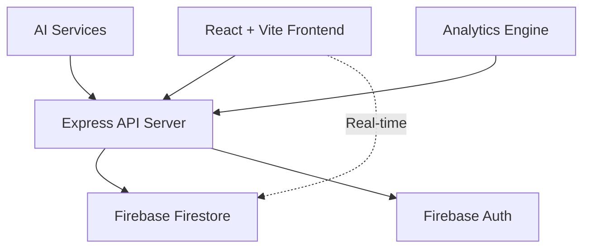

🚀 **Nexus TaskFlow**
*Real-time Task Management & AI-Powered Workflow Automation*

<div align="center">
  
[](https://vitejs.dev/)
[](https://reactjs.org/)
[](https://www.typescriptlang.org/)
[](https://firebase.google.com/)
[](https://expressjs.com/)
[](https://opensource.org/licenses/MIT)
[](https://github.com/ramcodeverse/nexus_taskflow)

</div>

---

## 🎯 **One-Liner**
> **Production-ready full-stack task management platform with real-time collaboration, AI extensibility, and SaaS-grade architecture.**

---

## ✨ **Why Nexus TaskFlow?**

| Feature | Technology |
|---------|-------------|
| 🎨 **Beautiful UI** | Framer Motion animations + CSS Modules / Tailwind |
| ⚡ **Fast Performance** | Vite + React 18 + Zustand state |
| 🔄 **Real-time Collaboration** | Firestore listeners + WebSocket (Express) + Multiplayer updates |
| 🤖 **AI-Ready** | OpenAI/Gemini hooks + Event-driven automation + Plugin system |
| 📱 **Mobile Responsive** | Fully adaptive design + Touch interactions |
| 🔒 **Enterprise Security** | Role-based access + Secure authentication (Firebase Auth) |

---

## 🚀 **Get Started in 60 Seconds**

```bash
# 1. Clone the repository
git clone https://github.com/ramcodeverse/nexus_taskflow.git
cd nexus_taskflow

# 2. Install dependencies
npm install

# 3. Configure environment
cp .env.example .env.local

# 4. Add your API keys (Firebase + Gemini/OpenAI)
# See .env.example for required format

# 5. Start development (frontend + backend concurrently)
npm run dev:full   # or `npm run dev` (frontend only) + `npm run server` (backend)
```

✅ **Done!** Open [http://localhost:5173](http://localhost:5173) (Vite default)

> 📘 The backend API runs on `http://localhost:3001` (configurable).

---

## 🌟 **Killer Features**

### 1. **Real-Time Task Management**
```
Todo ➜ In Progress ➜ Review ➜ Done
```
- ✨ Live updates across all users (Firestore snapshot listeners)
- 🎯 Priority levels + Due dates + Custom labels
- 📱 Drag & drop reordering
- 🔍 Full-text search with filters

### 2. **Team Collaboration**
```
👑 Admin | 👤 Member | 👀 Guest
```
- 💬 In-task comments & threads
- 🔔 @mentions & real-time notifications
- 📊 Shared team dashboards
- 🔐 Granular role-based permissions (Firebase Security Rules)

### 3. **AI Superpowers (Plug & Play)**

```javascript
// Auto-generate tasks from natural language
await ai.generateTasks("Schedule team meeting for design review...");

// Smart prioritization based on deadlines & workload
await ai.prioritizeTasks(workspaceId);

// Natural language search across all projects
await ai.search("What did John work on last week?");
```

### 4. **Analytics That Matter**
```
📈 87% completion rate
⏱️ 2.3h average task time
👥 Team velocity +23% month-over-month
📅 Weekly trend analysis
```

---

## 🏗️ **Architecture Overview**



---

## 🛠️ **Tech Stack**

```javascript
// Frontend
const frontend = {
  buildTool: "Vite 5",
  framework: "React 18",
  language: "TypeScript 5",
  styling: "CSS Modules / Tailwind CSS",
  state: "Zustand"
};

// Backend
const backend = {
  runtime: "Node.js + Express",
  database: "Firebase Firestore",
  auth: "Firebase Authentication",
  realtime: "Firestore listeners + Express WebSocket",
  validation: "Zod"
};

// Infrastructure
const infra = {
  hosting: "Railway / Vercel (frontend) + Railway (backend)",
  ci_cd: "GitHub Actions",
  security: "Firestore Security Rules + security_spec.md",
  testing: "Vitest + firestore.rules.test.ts"
};
```

---

## 📁 **Project Structure** (Actual)

```
nexus_taskflow/
├── 📁 src/                    # React frontend source
│   ├── components/            # Reusable UI components
│   ├── pages/                 # Page views
│   ├── hooks/                 # Custom React hooks
│   ├── store/                 # Zustand state stores
│   └── main.tsx               # Vite entry point
├── 🖥️ server.ts               # Express backend API
├── 📄 index.html              # Vite HTML template
├── ⚙️ vite.config.ts          # Vite configuration
├── 🔧 tsconfig.json           # TypeScript config
├── 📦 package.json            # Dependencies & scripts
├── 🔐 .env.example            # Environment variables template
├── 🧯 firestore.rules         # Firestore security rules
├── ✅ firestore.rules.test.ts # Security rules tests
├── 📋 firebase-applet-config.json  # Firebase Applet config
├── 📋 firebase-blueprint.json      # Firebase deployment blueprint
├── 📜 security_spec.md        # Detailed security specification
├── 📜 AGENTS.md               # AI agent guidelines
├── 📜 TODO.md                 # Development roadmap
├── 📜 metadata.json           # Project metadata
├── 🚫 .gitignore
├── 📄 Procfile                # Heroku/Railway process definition
├── 📜 LICENSE
├── 📖 README.md               # You are here
└── 🔧 eslint.config.js        # ESLint rules
```

---

## 🎪 **Live Demo**

<div align="center">
  <a href="https://taskflow-app-production-e8c8.up.railway.app">
    <strong>🔗 Try the Live Demo →</strong>
  </a>
</div>

> Demo account: `demo@nexus.com` / `demo123` (or register a new account)

---

## ⚡ **Deploy to Production**

### Frontend (Vite static hosting)
```bash
npm run build   # outputs to dist/
# Deploy dist/ to Netlify, Vercel, or any static host
```

### Backend (Express on Railway/Heroku)
```bash
# Railway: connect your repo, set environment vars
# Heroku: git push heroku main
```

### Full stack with PM2 (self-managed)
```bash
npm run build
pm2 start server.ts --interpreter node --watch
```

> 🔒 **Important**: Set `FIREBASE_ADMIN_KEY`, `VITE_FIREBASE_CONFIG`, `OPENAI_API_KEY` in production environment.

---

## 🔮 **Roadmap 2025**

| Status | Feature |
|--------|---------|
| ✅ **Done** | Real-time collaboration & RBAC auth (Firestore + Rules) |
| ✅ **Done** | Kanban board with drag & drop |
| 🔄 **Now** | AI task generation & smart prioritization |
| 📋 **Next** | Mobile app (React Native) |
| 📋 **Next** | Slack / Discord bot integration |

---

## 🤝 **Contributing**

We welcome contributions! Here's how to get started:

```bash
npm run dev        # Start dev server (frontend only)
npm run server     # Start Express backend
npm run test       # Run unit & Firestore rules tests
npm run lint       # Check code quality
npm run build      # Create production build (frontend)
```

Please read [AGENTS.md](./AGENTS.md) for contribution guidelines.

---

## 📜 **License**

**MIT** © 2024 [Ramcodeverse](https://ramcodeverse.com)

---

<div align="center">
  
**⭐ Star this repository if you love it!** 🚀

<br>

**Ramcodeverse** • 
[Portfolio](https://rams-portfolio-site.netlify.app/) • 
[GitHub](https://github.com/ramcodeverse)

</div>
```
