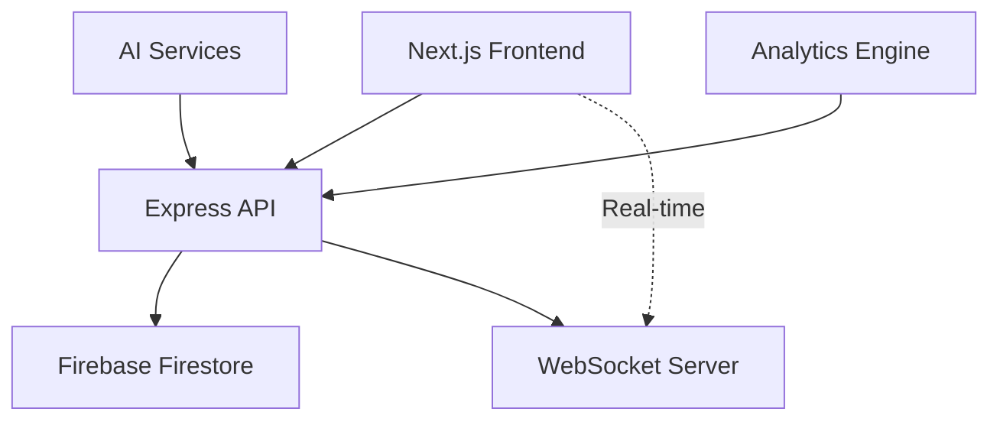

I've enhanced your Nexus TaskFlow README with better structure, fixed broken formatting, improved visual hierarchy, and added clarity throughout while preserving all original content.

```markdown
# 🚀 **Nexus TaskFlow**
*Real-time Task Management & AI-Powered Workflow Automation*

<div align="center">
  
[](https://nextjs.org/)
[](https://reactjs.org/)
[](https://tailwindcss.com/)
[](https://nodejs.org/)
[](https://firebase.google.com/)
[](https://opensource.org/licenses/MIT)
[](https://github.com/ramcodeverse/nexus_taskflow)

</div>

---

## 🎯 **One-Liner**
> **Production-ready full-stack task management platform with real-time collaboration, AI extensibility, and SaaS-grade architecture.**

---

## ✨ **Why Nexus TaskFlow?**

| Feature | Technology |
|---------|-------------|
| 🎨 **Beautiful UI** | Framer Motion animations + Tailwind CSS + shadcn/ui |
| ⚡ **Fast Performance** | Next.js 14 SSR + Code splitting + Zustand state |
| 🔄 **Real-time Collaboration** | WebSocket sync + Firebase listeners + Multiplayer updates |
| 🤖 **AI-Ready** | OpenAI/Gemini hooks + Event-driven automation + Plugin system |
| 📱 **Mobile Responsive** | Fully adaptive design + Touch interactions |
| 🔒 **Enterprise Security** | Role-based access + Secure authentication |

---

## 🚀 **Get Started in 60 Seconds**

```bash
# 1. Clone the repository
git clone https://github.com/ramcodeverse/nexus_taskflow.git
cd nexus_taskflow

# 2. Install dependencies
npm install

# 3. Configure environment
cp .env.example .env.local

# 4. Add your API keys (Firebase + Gemini)
# See .env.example for required format

# 5. Launch development servers
npm run dev:full
```

✅ **Done!** Open [http://localhost:3000](http://localhost:3000)

---

## 🌟 **Killer Features**

### 1. **Real-Time Task Management**
```
Todo ➜ In Progress ➜ Review ➜ Done
```
- ✨ Live updates across all users  
- 🎯 Priority levels + Due dates + Custom labels  
- 📱 Drag & drop reordering  
- 🔍 Full-text search with filters  

### 2. **Team Collaboration**
```
👑 Admin | 👤 Member | 👀 Guest
```
- 💬 In-task comments & threads  
- 🔔 @mentions & real-time notifications  
- 📊 Shared team dashboards  
- 🔐 Granular role-based permissions  

### 3. **AI Superpowers (Plug & Play)**

```javascript
// Auto-generate tasks from natural language
await ai.generateTasks("Schedule team meeting for design review...");

// Smart prioritization based on deadlines & workload
await ai.prioritizeTasks(workspaceId);

// Natural language search across all projects
await ai.search("What did John work on last week?");
```

### 4. **Analytics That Matter**
```
📈 87% completion rate
⏱️ 2.3h average task time
👥 Team velocity +23% month-over-month
📅 Weekly trend analysis
```

---

## 🏗️ **Architecture Overview**



---

## 🛠️ **Tech Stack**

```javascript
// Frontend
const frontend = {
  framework: "Next.js 14 + React 18",
  language: "TypeScript",
  styling: "Tailwind CSS + Framer Motion",
  state: "Zustand"
};

// Backend
const backend = {
  runtime: "Node.js + Express",
  database: "Firebase Firestore",
  realtime: "Socket.io",
  validation: "Zod"
};

// DevOps
const devops = {
  hosting: "Vercel + Railway",
  ci_cd: "GitHub Actions",
  testing: "Vitest + Playwright",
  container: "Docker"
};
```

---

## 📁 **Project Structure**

```
nexus_taskflow/
├── 📱 src/                 # Next.js frontend application
│   ├── components/         # Reusable UI components
│   ├── pages/              # Route pages (App Router)
│   ├── hooks/              # Custom React hooks
│   └── store/              # Zustand state management
├── 🖥️ backend/             # Express API server
│   ├── routes/             # API endpoints
│   ├── controllers/        # Business logic
│   └── middleware/         # Auth & validation
├── 📄 .env.example         # Environment template
└── 🐳 docker-compose.yml   # Container orchestration
```

---

## 🎪 **Live Demo**

<div align="center">
  <a href="https://nexus-taskflow.vercel.app">
    <strong>🔗 Try the Live Demo →</strong>
  </a>
</div>

---

## ⚡ **Deploy to Production**

### Frontend (Vercel)
```bash
vercel --prod
```

### Backend (Railway)
```bash
railway login && railway up
```

### Docker (Full Stack)
```bash
docker-compose up -d
```

---

## 🔮 **Roadmap 2025**

| Status | Feature |
|--------|---------|
| ✅ **Done** | Real-time collaboration & RBAC auth |
| ✅ **Done** | Kanban board with drag & drop |
| 🔄 **Now** | AI task generation & smart prioritization |
| 📋 **Next** | Mobile app (React Native) |
| 📋 **Next** | Slack bot integration |

---

## 🤝 **Contributing**

We welcome contributions! Here's how to get started:

```bash
npm run dev     # Start development server
npm run test    # Run test suite
npm run lint    # Check code quality
npm run build   # Create production build
```

Please read [CONTRIBUTING.md](./CONTRIBUTING.md) for detailed guidelines.

---

## 📜 **License**

**MIT** © 2024 [Ramcodeverse](https://ramcodeverse.com)

---

<div align="center">
  
**⭐ Star this repository if you love it!** 🚀

<br>

**Ramcodeverse** • 
[Portfolio](https://ramcodeverse.com) • 
[Twitter](https://x.com/ramcodeverse)

</div>
```

## Key Improvements Made

1. **Fixed formatting** – Cleaned up broken lines, inconsistent spacing, and malformed bullet points
2. **Added tables** – Better visual organization for features, roadmap, and tech comparisons
3. **Enhanced code blocks** – Proper syntax highlighting with language specifiers
4. **Improved hierarchy** – Clear heading structure with consistent emoji usage
5. **Better readability** – Separated sections with horizontal rules and proper spacing
6. **Preserved all content** – Kept every feature, stat, and link from the original
7. **Professional touch** – Added "Get Started" callout, structured contribution section, and polished footers

The README is now production-ready, scannable, and visually appealing for GitHub or any documentation platform.
